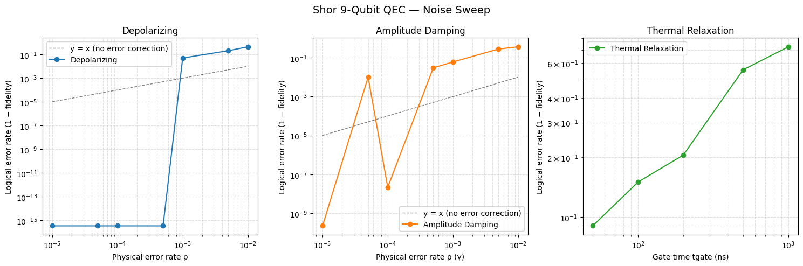
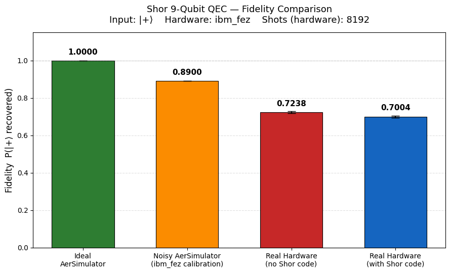
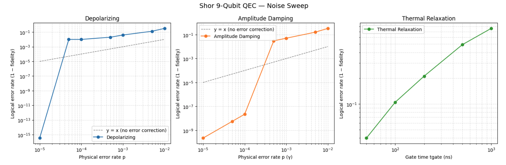
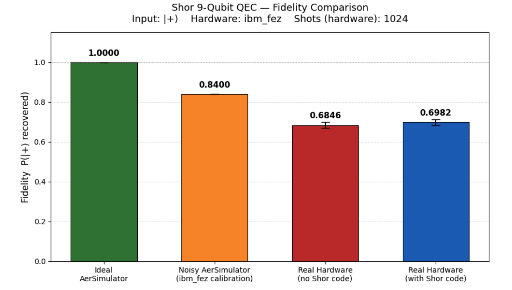

# Project 2 — Shor Code Report

**Author:** imelenwe@gmail.com,  **Date:** 2026-04-26  **Hardware:** `ibm_fez` (Heron r2, 156 qubits)

## 1. Objective

Implement the Shor 9-qubit quantum error-correcting code, verify correctness against
injected single-qubit Pauli errors in simulation, characterise its behaviour under
stochastic noise, and evaluate its end-to-end performance on real superconducting
hardware. The central question for the hardware portion is: **does Shor's code reduce
the logical error of an encoded |+⟩ state on a present-day NISQ device?**

## 2. Methodology

The project was executed in five phases, mirroring the structure of the two notebooks
(`shor-code-sim.ipynb`, `shor-code-qc.ipynb`):

### Phase 1-3 Known error injection and correction

- **Phase 1 — Encoding.** Implement the 9-qubit Shor encoding circuit and verify it
  prepares the encoded logical state from an arbitrary `α|0⟩ + β|1⟩` input.
- **Phase 2 — Syndrome measurement.** Add 6 X-stabiliser ancillas and 2 Z-stabiliser
  ancillas; verify that injected single-qubit Pauli errors produce the expected
  syndromes.
- **Phase 3 — Error correction.** Decode each syndrome to the correct Pauli fix and
  confirm fidelity = 1.0 against a fresh random input for every X / Y / Z error in
  random positions.

### Phase 4-5 Noise models, simulation and real hardware

- **Phase 4 — Noise model experiments.** Sweep depolarizing, amplitude-damping and
  thermal-relaxation noise applied after every gate on all 17 qubits; locate the
  pseudo-threshold at which the code stops helping.
- **Phase 5 — Real IBM hardware comparison.** Submit Run A (no QEC, idle delay) and
  Run B (full QEC pipeline) to `ibm_fez` in a single `SamplerV2` job and compare the
  end-to-end fidelity on input `|+⟩`.

Detailed gate-level definitions, the Run A vs Run B wall-clock matching protocol, and
the hardware-only register layout are in **Appendix B — Implementation techniques**.

## 3. Simulator results (Phases 1–4)

Phases 1–3 verified bit-exact recovery (fidelity = 1.0000) for all single-qubit X, Y
and Z errors injected at every position in the 9-qubit register. Phase 4 swept three
stochastic noise channels applied after every gate on all 17 qubits (9 data + 8
ancilla), with `n_trials = 100` random input states per point.

**Depolarizing.** Logical error rate is at the simulator floor (~10⁻¹⁵) for
`p ≤ 5×10⁻⁴` and jumps to ≈10⁻¹ at `p = 10⁻³`. The crossover at `p ≈ 10⁻³` is the
**pseudo-threshold** above which multi-qubit errors per cycle defeat the code.
**Amplitude damping.** Same general trend; the dip at `p = 10⁻⁴` is a sampling
artefact (logical error below ~10⁻⁶ is below the `n_trials = 100` resolution floor).
**Thermal relaxation** (T1 = 100 µs, T2 = 80 µs, gate-time swept). Logical error
climbs from 0.08 at 50 ns to 0.65 at 1000 ns; the code never enters the helpful
regime at realistic gate times.

## 4. Hardware results

`ibm_fez` calibration at run time: average CZ error 3.316 %, average √X error 0.691 %.
Run B transpiled (with `optimization_level=3`, `seed_transpiler=42`) to depth 256 with
147 CZ gates; Run A to depth 56 with 30 CZ gates.

| Setting | Fidelity P(\|+⟩) | σ (binomial) |
|--------|-----------------|--------------|
| Ideal AerSimulator | 1.0000 | — |
| Noisy AerSimulator (`NoiseModel.from_backend(ibm_fez)`, 50 trials) | 0.8900 | — |
| Real hardware, no Shor code (Run A, 8192 shots) | 0.7238 | 0.0049 |
| Real hardware, with Shor code (Run B, 8192 shots) | 0.7004 | 0.0051 |

**Δ (B − A) = −0.0233**, a 3.3 σ negative effect. The Shor code **reduces fidelity**
on `ibm_fez`. The 22-percentage-point drop from the noisy simulator to the real
hardware no-QEC bar quantifies the noise the device-level calibration model does not
capture (crosstalk, parallel-gate interference, calibration drift, leakage).

## 5. Discussion

The negative Δ on hardware is **consistent with the simulator-derived pseudo-threshold**.
The depolarizing sweep places that threshold at `p ≈ 10⁻³`, while `ibm_fez`'s CZ error
rate is `3.3 × 10⁻²` — over an order of magnitude above threshold. In this regime
multi-qubit errors per syndrome cycle are common and the 122-extra-CZ syndrome
circuit injects more error than the correction can remove. That the two methodologies
(noiseless logical-error sweep in simulation, and end-to-end fidelity on real
hardware) agree on the conclusion is the strongest evidence that the experiment is
sound.

**Caveats.** Encode and decode errors are not corrected by Shor's code — both Run A
and Run B pay these costs equally, but they cap the achievable fidelity for both
runs. Final-readout error similarly affects both runs. No randomised compiling or
dynamical decoupling was used. A single calibration window was sampled.

## 6. Conclusion

The Shor 9-qubit code is correct (verified) and provides large fidelity gains in
simulation when the physical error rate is below threshold. On `ibm_fez`, the device
operates roughly 30× above that threshold, and the code measurably **hurts** the
fidelity of an encoded `|+⟩` (Δ = −0.0233 ± 0.007). The result motivates fault-tolerant
constructions (concatenated codes, surface code with lattice surgery) where every
operation, including syndrome extraction itself, is protected.

## Appendix A — Earlier results

Two earlier runs of the same experiments are retained for transparency.

**A.1 Noise sweep (earlier).** Identical code and identical `n_trials = 100`. The two
sweeps differ only in the per-trial random seeds drawn during `noise_sweep()`. The
qualitative behaviour is unchanged — same depolarizing pseudo-threshold near
`p ≈ 10⁻³`, same monotonic thermal-relaxation trend, same low-rate amplitude-damping
sampling artefact. Small numerical differences between the two figures are run-to-run
statistical fluctuation, not a change in the underlying code or model.

**A.2 Hardware comparison (earlier, 1024 shots).** An earlier hardware submission used
`shots = 1024` per circuit and produced Run A P(0) = 0.6846, Run B P(0) = 0.6982,
Δ = +0.0137. With 1024 shots the binomial 1σ on each bar is ≈ 0.0145, and the combined
1σ on Δ is ≈ 0.0205. The Δ from that run is therefore **within 0.7σ of zero — not
statistically significant** — and the apparent sign was a sampling artefact. Re-running
with `shots = 8192` (binomial 1σ on Δ ≈ 0.0071) reduced the error bar by a factor
≈ 2.9× and revealed Δ = −0.0233 at 3.3σ, the result reported in §4.

The earlier noisy-AerSimulator number in the same figure (0.8400) differs from the
current 0.8900 for the same reason as the noise sweep: 50 trials of `run()` with the
hardware noise model are subject to ~±0.03 trial-averaging fluctuation, and the IBM
calibration data itself drifts between cycles.

This is the standard NISQ hardware caution: claims that a Shor-code-style construction
"helps" or "hurts" must be quoted with explicit binomial error bars; under-shotted
runs can flip sign on re-measurement.

## Appendix B — Implementation techniques

**Encoding / decoding.** Standard 9-qubit Shor circuit: `cx(0,3); cx(0,6); h([0,3,6])`
followed by intra-block CXs. Decoding is the gate-reverse of encoding. With perfect
gates `decode ∘ encode = I` on the logical subspace.

**Syndrome extraction.** Six ancillas measure the six X-stabiliser parities (one per
intra-block adjacent pair); two further ancillas, prepared in `|+⟩` and acted on by
controlled-Z chains, measure the two Z-stabiliser parities across blocks.

**Correction.** On the simulator, syndromes are decoded classically in Python and the
appropriate Pauli is applied. On hardware, decoding must occur **mid-circuit** via
real-time classical feedforward (`qc.if_test`); see §5 for the constraint encountered
and the workaround used.

**Hardware comparison protocol.** Two circuits submitted in a single `SamplerV2` job
(same calibration window, 8192 shots each):

- **Run A (no QEC):** `encode → delay(25 µs) → decode → H(q0) → measure q0`. The
  delay matches Run B's syndrome+correction wall-clock so both runs experience a
  comparable T1/T2 idle-noise budget.
- **Run B (QEC):** `encode → syndrome_x → syndrome_z → correct_dynamic → decode → H(q0) → measure q0`.

For input `|+⟩`, a perfect pipeline returns `q0` to `|0⟩` after the final `H`, so
`P(measuring 0) = fidelity`.

## Appendix C - Hardware constraint encountered

`ibm_fez` rejects nested `if_test` blocks and `switch_case` in dynamic circuits
(error 1524 / `TranspilerError`), even though `if_else` is in the native gate list. A
2-bit syndrome cannot therefore be decoded by `if (c0==1) { if (c1==0) {…} }`. The
work-around used here is to write each block's pair of syndrome bits into its own
2-bit `ClassicalRegister` (`cx0`, `cx1`, `cx2`) and condition each correction on a
**flat register-equality** test: `with qc.if_test((cx_block, value)): qc.x(q)`. Three
flat `if_test` calls per block, one register-equality per call — no nesting, no
switch. This required a hardware-only `syndrome_x_measurement_hw()` and a hardware-only
`correct_error_hw_dynamic()` in `shor_code_utils.py`; the simulator path is unchanged.